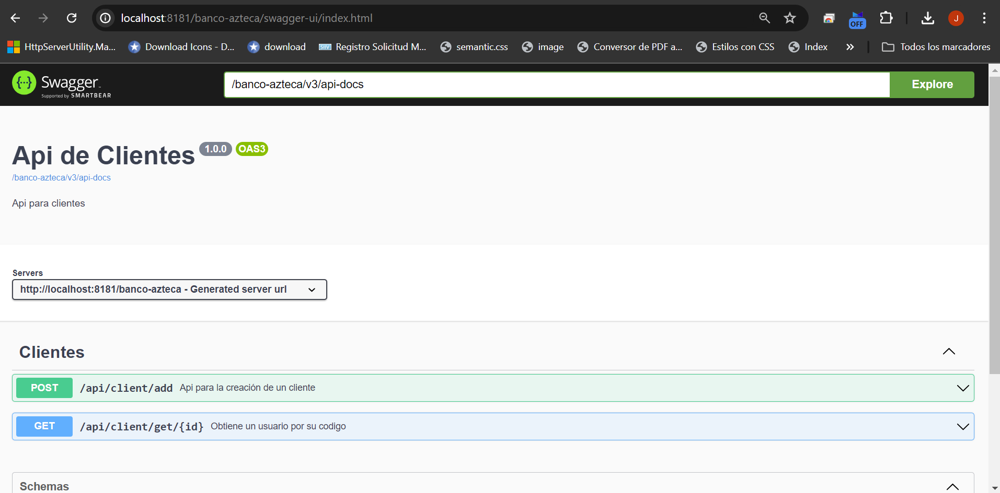

# api cliente
Creacion api para el registro y consulta de cliente - prueba tecnica para desarrollador java - Banco Azteca

- Al levantar el proyecto se debe configurar para ser ejecutado con JAVA 17 y MAVEN 3.8.7
- Se debe ejecutar el siguiente comando para instalar las liberias
```
nvm clean install
```
Para ingresar a visualizar el swagger se debe seguir la siguiente ruta: 
```
http://localhost:8181/banco-azteca/swagger-ui/index.html
```



Para crear la base de datos se debe ejecutar en Mysql el siguiente script (usuario : root / password : root) :
```
CREATE DATABASE bancoazteca;
use bancoazteca;
CREATE TABLE `cliente` (
`codigocliente` int(11) NOT NULL AUTO_INCREMENT,
`nombres` varchar(50) NOT NULL,
`appaterno` varchar(50) NOT NULL,
`apmaterno` varchar(50) NOT NULL,
`nacimiento` date NOT NULL,
`genero` varchar(1),
`correo` varchar(200) NOT NULL,
`telefono` varchar(20) DEFAULT NULL,
`estado` varchar(1) NOT NULL DEFAULT '1' COMMENT '1=Activo, 0=No Activo',
PRIMARY KEY (`codigocliente`),
UNIQUE KEY `IDX_cliente_2` (`nombres`,`appaterno`,`apmaterno`)
) ENGINE=InnoDB AUTO_INCREMENT=1 DEFAULT CHARSET=utf8;
```

Para probar la solucion mediante postman:

Para crear un cliente se debe ejecutar la siguiente URL:
```
POST http://localhost:8181/banco-azteca/api/client/add
Requestbody:
{
    "nombres": "Jose Luis",
    "appaterno": "Calderon",
    "apmaterno": "Jimenez",
    "nacimiento": "20/04/1991",
    "genero": "M",
    "correo": "rojas@gmail.com",
    "telefono": "213123123",
    "estado": "A"
}
```

Para obtener un cliente por su codigo se debe ejecutar la siguiente URL:
```
GET http://localhost:8181/banco-azteca/api/client/get/1
```